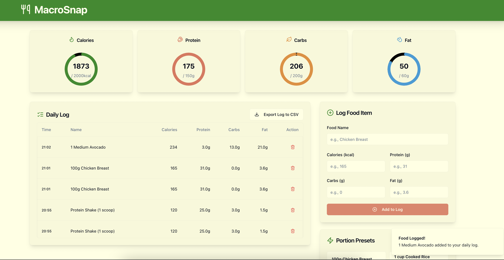

# MacroSnap



## About The Project

MacroSnap is a web application designed to help you easily track your daily macronutrient intake. It features AI-powered food suggestions, quick-add functionality for foods, and progress tracking to help you stay on top of your nutritional goals.

### Built With

*   [Next.js](https://nextjs.org/) (v15) with Turbopack
*   [React](https://reactjs.org/) (v18)
*   [TypeScript](https://www.typescriptlang.org/)
*   [Tailwind CSS](https://tailwindcss.com/)
*   [Genkit (Firebase)](https://firebase.google.com/docs/genkit) for AI flows
*   [Google Gemini](https://ai.google.dev/) for AI-powered suggestions
*   [Shadcn UI](https://ui.shadcn.com/) & [Radix UI](https://www.radix-ui.com/) for UI components
*   [React Hook Form](https://react-hook-form.com/) for form handling
*   [Zod](https://zod.dev/) for schema validation
*   [Lucide React](https://lucide.dev/) for icons
*   [Recharts](https://recharts.org/) for charts

## Getting Started

To get a local copy up and running, follow these simple steps.

### Prerequisites

*   Node.js (v18 or later recommended)
*   npm (comes with Node.js)

### Installation

1.  Clone the repo:
    ```sh
    git clone https://github.com/your_username/macro-snap.git
    cd macro-snap
    ```
2.  Install NPM packages:
    ```sh
    npm install
    ```

### Environment Variables

For AI-powered features (like food suggestions), you'll need to set up your Gemini API key.

1.  Create a `.env` file in the root of the project:
    ```sh
    touch .env
    ```
2.  Add your API key to the `.env` file:
    ```
    GOOGLE_API_KEY="YOUR_GEMINI_API_KEY"
    # or GEMINI_API_KEY="YOUR_GEMINI_API_KEY"
    ```
    If the API key is not provided, the application will still run, but AI-dependent features may not function correctly and might return errors.

### Running the Development Server

To start the development server (usually on `http://localhost:9002`):

```sh
npm run dev
```

The application uses Next.js with Turbopack for fast development builds.

## Available Scripts

In the project directory, you can run the following scripts:

*   `npm run dev`: Runs the app in development mode with Turbopack.
*   `npm run build`: Builds the app for production.
*   `npm run start`: Starts the production server (after building).
*   `npm run lint`: Lints the codebase using Next.js's built-in ESLint configuration.
*   `npm run typecheck`: Runs TypeScript to check for type errors.
*   `npm run genkit:dev`: Starts the Genkit development server (for AI flows).
*   `npm run genkit:watch`: Starts the Genkit development server with watch mode.

## Project Structure Highlights

*   `src/app/`: Main application code (Next.js App Router).
*   `src/components/`: Reusable UI components.
*   `src/lib/`: Utility functions and libraries.
*   `src/ai/`: Genkit AI flows and configuration.
    *   `src/ai/genkit.ts`: Genkit plugin initialization.
    *   `src/ai/flows/`: Specific AI flow definitions.
*   `public/`: Static assets (though icons might be in `src/app/` as per Next.js conventions).

## Contributing

Contributions are what make the open-source community such an amazing place to learn, inspire, and create. Any contributions you make are **greatly appreciated**.

If you have a suggestion that would make this better, please fork the repo and create a pull request. You can also simply open an issue with the tag "enhancement".
Don't forget to give the project a star! Thanks again!

1.  Fork the Project
2.  Create your Feature Branch (`git checkout -b feature/AmazingFeature`)
3.  Commit your Changes (`git commit -m 'Add some AmazingFeature'`)
4.  Push to the Branch (`git push origin feature/AmazingFeature`)
5.  Open a Pull Request